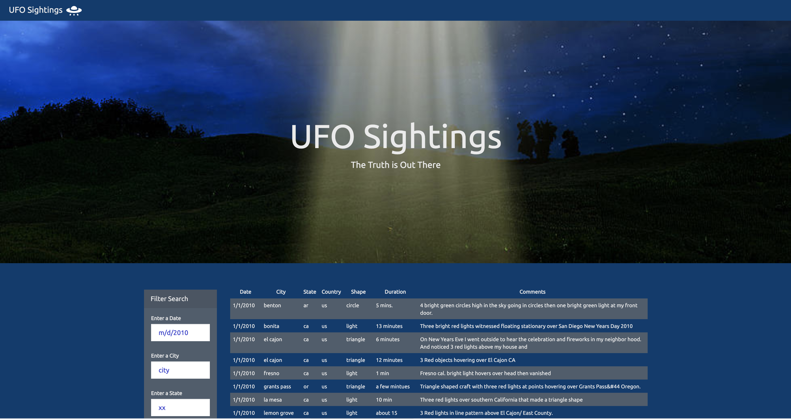
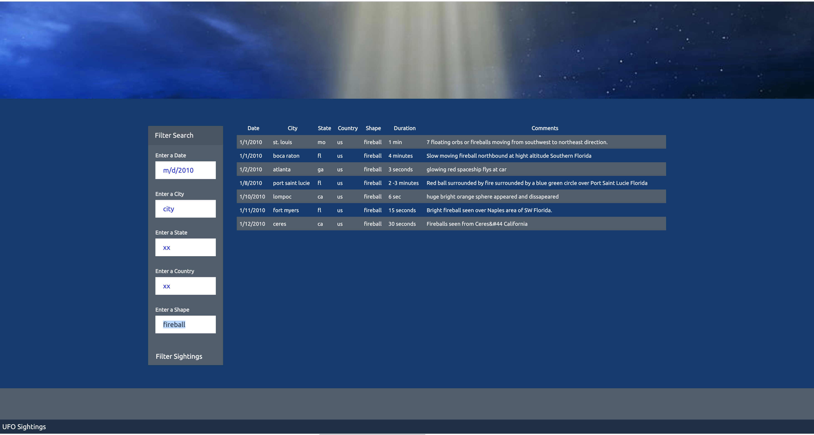
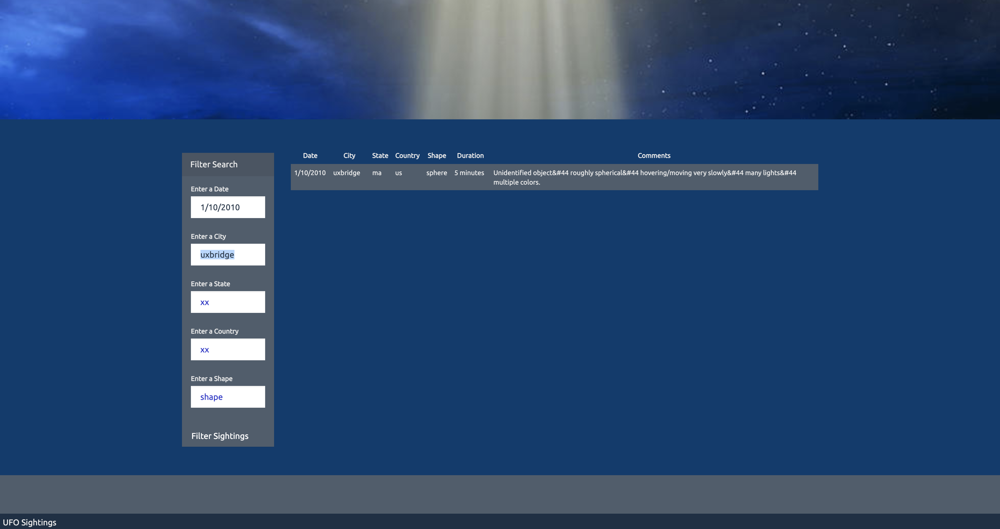

# javascript-challenge :flying_saucer:

Created by [Celeste Muniz - Lithgow](https://github.com/celeste1030)

## Table of Contents
* [Objective](#objective)
* [UFO Filtering](#UFO-Filtering)
* [Screenshots](#Screenshots)
* [Technologies](#technologies)

## Objective

In this assignment, I wrote code to create a table dynamically based upon the dataset provided. I used JavaScript, HTML, CSS, and D3.js to allow users to filter the table data for specific values.

## UFO Filtering

I used javascript to create a table that fills with the given UFO dataset. Both steps of the assignment are included in the following file. Check out the code here:

* [Filtering with Java](UFO-levels-1-and-2/static/js/app.js)

## Screenshots

Screenshots from final HTML page:

I edited the [style.css](UFO-levels-1-and-2/static/css/style.css) provided to give the page a unique look. 

- - - - - - - - - - - - - - - - - - - - - - - - - - - - - - - - - - - - - - - - -

Filter by state:

- - - - - - - - - - - - - - - - - - - - - - - - - - - - - - - - - - - - - - - - -

Filter by shape:

- - - - - - - - - - - - - - - - - - - - - - - - - - - - - - - - - - - - - - - - -

Filter by multiple fields (date, city):

## Technologies

JavaScript

D3.js

CSS

HTML

Bootstrap